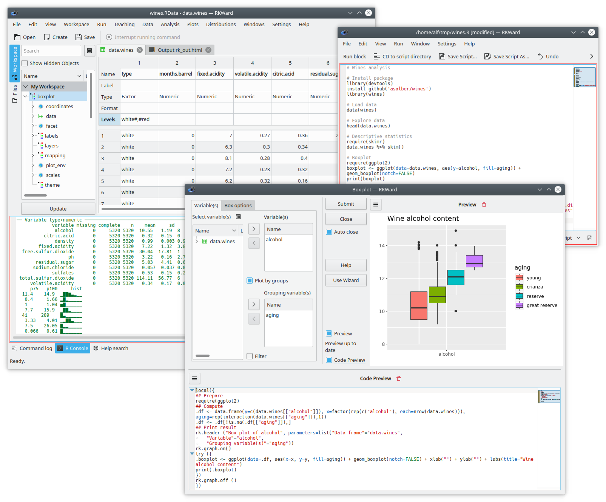
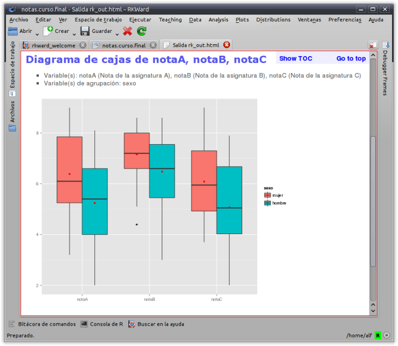

{}

## What is rkTeaching?

rkTeaching is an [R](http://www.r-project.org/) package that provides a plugin for the graphical user interface [RKWard](http://rkward.sourceforge.net/) adding new menus and dialog specially 
designed for teaching and learning Statistics.

This package has been developed and is maintained by Alfredo Sánchez Alberca <asalber@ceu.es> in the Department of Applied Math and Statistics of the San Pablo CEU of Madrid.

If you find out some error or have a suggestion, please, let me know it by email or opening an [issue on Github](https://github.com/rkward-community/rkTeaching/pulls).



## Installation

### Installation on Windows

For Windows users there is a bundle that include R, RKWard and rkTeaching.

[Download last version (R versión 3.6.2, RKWard versión 0.7.1b, rkTeaching versión 1.3.0)](https://drive.google.com/file/d/17eWedHkSI1f0pIjAra94HOwagchr-h7T/view?usp=sharing)

Once the file is downloaded, all you have to do is to execute it.
It will ask for the installation unit and directory.
It is recommended to install it on the root of unit C, that ist C:\.
The installation creates a folder rkward into the installation directory. There, in the bin folder you have to execute the `rkward.exe` file to start the program.

The following video tutorial shows the installation process (in Spanish).



### Installation on Mac OS

To install the software on Mac OS systems, you must take the following steps:

1. **Install R**. R can be downloaded from the web [https://cran.r-project.org](https://cran.r-project.org/bin/macosx/el-capitan/base/R-3.5.3.pkg).
It is recommended version 3.5.3 for MacOs.

1. **Install RKWard**. RKWard can be downloaded from the web <http://rkward.sourceforge.net>.
You have to select the Mac Os distribution (<https://download.kde.org/stable/rkward/0.7.0/mac/RKWard-binary-0.7.0b_OSX10.11_KF5-5.42.0_needs_CRAN_R-3.5.0.pkg>) and follow the instructions there.
It is required a Mac Os version 10.11 or higher.

    If there is some error during the installation process, check for the possible solutions (<http://rkward.sourceforge.net/wiki/RKWard_on_Mac#Troubleshooting>)

1. **Install the packages that rkTeaching depends on**. The rkTeaching package depends on several packages that should be installed first.
To install this packages you must run RKWard, open the R console and type the following commands:

    ```R
    install.packages(c("R2HTML","car","e1071","Hmisc","plyr","ggplot2","prob","ez","remotes"))
    ```

4. **Install rkTeaching**. To install the rkTeaching package you must type the following commands in the R console:

    ```R
    library(remotes)
    install_github("rkward-community/rk.Teaching")
    ```

    The following video tutorial shows the installation process.

    

### Installation on Linux

To install the software in Mac OS systems, you must take the following steps:

1. **Install R**. R can be downloaded from the web <https://cran.r-project.org/>.
You have to select the Linux distribution and follow the instructions there.
It is required an R version 3.4 or higher.

    With Debian based distributions like Ubuntu, you can install R from the command line typing the command:

    ```sh
    sudo apt-get install rbase
    ```

2. **Install RKWard**. RKWard can be downloaded from the web <http://rkward.sourceforge.net>.
You have to select the Linux distribution and follow the instructions there.

    With Debian based distributions like Ubuntu, you can install R from the command line typing the command:

    ```sh
    sudo apt-get install rkward
    ```

    It is important to install versión 0.7 or higher.

3. **Install the packages that rkTeaching depends on**. The rkTeaching package depends on several packages that should be installed first.
To install this packages you must run RKWard, open the R console and type the following commands:

    ```R
    install.packages(c("R2HTML","car","e1071","Hmisc","plyr","ggplot2","prob","ez","remotes"))
    ```

4. **Install rkTeaching**. To install the rkTeaching package you must type the following commands in the R console:

    ```R
    library(remotes)
    install_github("rkward-community/rk.Teaching")
    ```

    The following video tutorial shows the installation process (in Spanish).

    

## Statistical procedures

Once installed a new menu `Teaching` will appear in RKWard with the following statistical procedures:

- Data manipulation:
  - Fiter data
  - Calculate variable
  - Recoding variable
  - Weight data
- Frequency distributions:
  - Frequency tabulation
  - Bidimensional frequency tabulation
- Plots:
  - Bar graph
  - Histogram
  - Pie graph
  - Box graph
  - Means graph
  - Interaction graph
  - Scatterplot
- Descriptive statistics
  - Statistics
  - Detailed calculation
- Regression:
  - Linear Regression
  - Non linear regression
  - Regression model comparison
  - Regression prediction
- Parametric tests:
  - Means:
    - T test for one sample
    - T test for two independent samples
    - T test for two paired samples
    - ANOVA
    - Sample size calculation for mean estimation
  - Variances:
    - Fisher test for two samples
    - Levene test for multiple samples
  - Proportions:
    - Test for one proportion
    - Test for two proportions
    - Sample size calculation for proportion estimation
- Non parametric tests:
  - Normality tests: Shapiro-Wilk, Kolmogorov
  - U Mann-Whitney test
  - Wilcoxon test
  - Friedman test
  - Kruskal-Wallis test
  - Chi-square test
- Concordance
  - Intraclass correlation coefficient
  - Cohen's kappa
- Probability:
  - Random games:
    - Coins
    - Dice
    - Cards
    - Urn
  - Build probability space
  - Combine probability spaces
  - Repeat probability space
  - Calculate probability
- Probability distributions
  - Discrete:
    - Binomial
    - Geometric
    - Hypergeometric
    - Poisson
  - Continous:
    - Uniform
    - Normal
    - Chi-square
    - Student's T
    - Fisher's F
- Simulations:
  - Law of rare events

## Functionality

- Menus and dialogs specially designed to easy the learning, ruling out non-common options to get an simplified and intuitive interface.

- All the dialogs have a wizard that guide the user step by step through the statistical procedure.
  

- HTML output tha presents the results of the analysis in a clear and concise way.
    

- Charts based in the modern [ggplot2](http://ggplot2.org/) package.
  

- Computation formulas and details available for some statistical procedures.
  

rkTeaching is maintained by [asalber](https://github.com/asalber).

## How to cite rkTeaching?

Sánchez-Alberca, A. (2020). rkTeaching (version 1.3) [software]. Get from: http://aprendeconalf.es/projects/rkteaching.