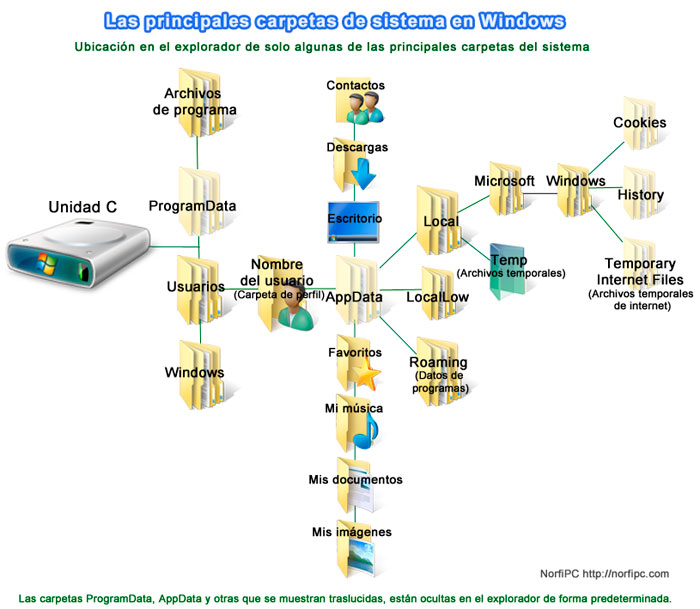

<!-- [<button type="button" class="btn btn-outline-primary"> Descargar</button>](manual-python.pdf) -->

El sistema de archivos del sistema operativo Windows organiza el contenido de los discos duros en unidades. El disco duro principal es la unidad `C:`. En cada unidad, los archivos se organizan en directorios (carpetas) siguiendo una estructura de árbol cuya raíz es siempre el directorio principal que se representa como la barra invertida `\`. El directorio principal contiene todos los archivos del disco duro.

## Rutas absolutas y relativas

La ubicación de un archivo o un directorio en la estructura de árbol de la unidad se puede determinar mediante una ruta absoluta o una ruta relativa.

La **ruta absoluta** de un archivo o directorio es la secuencia de directorios que hay que atravesar para llegar al archivo o directorio en cuestión desde el directorio raíz. 

La **ruta relativa** de un archivo o directorio es la secuencia de directorios que hay que atravesar para llegar al archivo o directorio en cuestión desde el directorio activo. Para referirse al directorio madre se utiliza el alias `..`, mientras que para referirse al propio directorio activo se utiliza el alias `.`.

Mientras que la ruta absoluta de un archivo o directorio es única, la ruta relativa depende del directorio activo.

**Ejemplo**. Supongamos el siguiente árbol de directorios.

La ruta absoluta al directorio `Programación` sería `C:\Usuarios\Alumno\Grado\Primero\Programación`, mientras que la ruta relativa, asumiendo que el directorio activo es `Primero`, es `.\Programación`.
Del mismo modo, la ruta relativa hasta el directorio `Segundo` sería `..\Segundo`.

## Comandos 

|Comando | Acción
|:---|:---|
|`ls` | Muestra un listado con el contenido del directorio actual.|
|`ls -l` | Muestra un listado detallado con el contenido del directorio actual.|
|`ls -la`| Muesta un listado detallado con el contenido del directorio actual, incluyendo os archivos ocultos.
|`ls <dir>` | Muestra un listado del directorio `<dir>`.|
|`cd <dir>` | Cambia al directorio `<dir>` convirtiéndolo en el directorio activo.|
|`mkdir <dir>` | Crea el directorio `<dir>`.|
|`mv <origen> <destino>` | Mueve el archivo o directorio `<origen>` al directorio `<destino>`.|
|`rm <f>` | Elimina el archivo `<f>`. |
|`rmdir <dir>` | Elimina el directorio `<dir>` y todo su contenido.|
