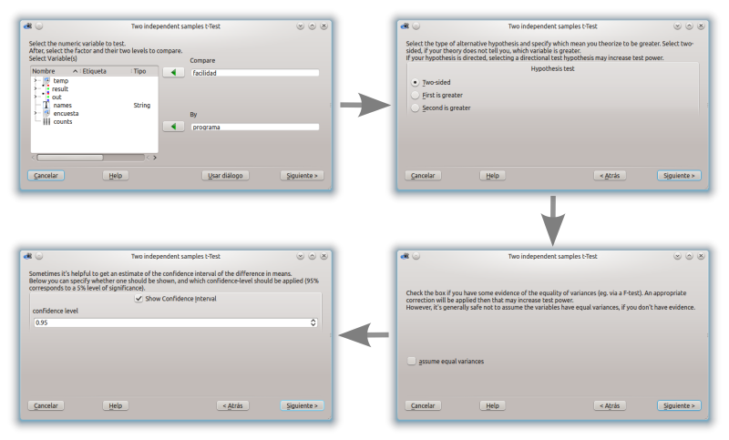
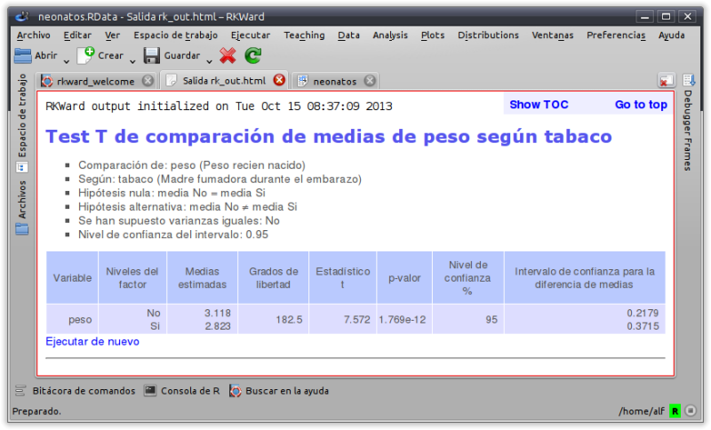

{}

## ¿Qué es rkTeaching?

rkTeaching es un paquete de [R](http://www.r-project.org/) que proporciona un plugin para la interfaz gráfica [RKWard](http://rkward.sourceforge.net/) añadiendo nuevos menús y cuadros de diálogo especialmente diseñados para la enseñanza de Estadística.

El paquete ha sido desarrollado y es mantenido por Alfredo Sánchez Alberca <asalber@ceu.es> del Departamento de Matemáticas de la Universidad San Pablo CEU de Madrid.

Si descubre algún error o tiene cualquier sugerencia, por favor, envíeselo por correo al autor o bien indíquelo como un [issue en Github](https://github.com/asalber/rkTeaching_es/issues).


## Instalación

### Instalación en Windows

Para usuarios de plataformas Windows existe un programa de instalación que incluye R, RKWard y rkTeaching.

[Descarga la última versión (R versión 3.6.2, RKWard versión 0.7.1b, rkTeaching versión 1.3.0)](https://drive.google.com/file/d/17eWedHkSI1f0pIjAra94HOwagchr-h7T/view?usp=sharing)

Una vez descargado el fichero, sólo hay que ejecutarlo para descomprimirlo.
Al ejecutarse aparecerá un cuadro de diálogo donde preguntará por la unidad y el directorio de instalación y es importante indicar que se instale en la carpeta raíz del disco duro C, es decir en la dirección C:\, tras esto se creará una carpeta rkward y dentro de ella la carpeta bin donde se encuentra el fichero `rkward.exe` que hay que ejecutar para arrancar RKWard.

El siguiente vídeo muestra el proceso de instalación.



### Instalación en Mac Os

Para instalar el software en plataformas Mac Os debe instalarse cada programa por separado con el siguiente orden:

1. **Instalar R**. R puede descargarse desde la página [https://cran.r-project.org/](https://cran.r-project.org/bin/macosx/el-capitan/base/R-3.5.3.pkg).
Se recomienda instalar la versión 3.5.3 para MacOs.

2. **Instalar RKWard**. RKWard puede descargarse desde la página <http://rkward.sourceforge.net>. 
Debe seleccionarse la distribución correspondiente a Mac Os (<https://download.kde.org/stable/rkward/0.7.0/mac/RKWard-binary-0.7.0b_OSX10.11_KF5-5.42.0_needs_CRAN_R-3.5.0.pkg>) y seguir las instrucciones de instalación que allí se especifican.
Es importante asegurase de tener una versión de Mac OS X 10.11 o superior, ya que RKWard no funciona con versiones anteriores.

    Si hay algún error en la instalación, consultar las posibles soluciones en (<http://rkward.sourceforge.net/wiki/RKWard_on_Mac#Troubleshooting>)

1. **Instalar los paquetes de los que depende rkTeaching**. Para instalar rkTeaching primero hay que instalar los paquetes de R de los que depende.
Para ello, hay que ejecutar R en línea de comandos, o bien arrancar RKWard e ir a la solapa de la Consola de R (R console) e introducir los siguientes comandos:

    ```R
    install.packages(c("R2HTML","car","e1071","Hmisc","plyr","ggplot2","prob","ez","multcomp", "remotes"))
    ```

4. **Instalar rkTeaching**. La mejor forma de instalar rkTeaching desde este repositorio es utilizando el paquete de R `devtools`.
Para ello hay que introducir los siguientes comandos en la consola de R: 

    ```R
    library(remotes)
    install_github("rkward-community/rk.Teaching")
    ```

    El siguiente vídeo muestra el proceso de instalación.

    

### Instalación en Linux

Para instalar el software en plataformas Linux debe instalarse cada programa por separado con el siguiente orden:

1. **Instalar R**. R puede descargarse desde la página <http://cran.es.r-project.org/>. 
Debe seleccionarse la distribución correspondiente a Linux y seguir las instrucciones de instalación que allí se especifican.
Es necesario que la versión de R sea la 3.0 o superior.

    En sistemas Debian y Ubuntu, puede instalarse desde la línea de comandos con el comando:

    ```sh
    sudo apt-get install rbase
    ```

2. **Instalar RKWard**. RKWard puede descargarse desde la página <http://rkward.sourceforge.net>. 
Debe seleccionarse la distribución correspondiente a Linux y seguir las instrucciones de instalación que allí se especifican.

    En sistemas Debian y Ubuntu, puede instalarse desde la línea de comandos con el comando:

    ```sh
    sudo apt-get install rkward
    ```

    Es importante asegurarse de que la versión instalada es la 0.6.5 o superior.

3. **Instalar los paquetes de los que depende rkTeaching**. Para instalar rkTeaching primero hay que instalar los paquetes de R de los que depende. 
Para ello, hay que ejecutar R en línea de comandos, o bien arrancar RKWard e ir a la solapa de la Consola de R (R console) e introducir los siguientes comandos:

    ```R
    install.packages(c("R2HTML","car","e1071","Hmisc","plyr","ggplot2","prob","ez","multcomp", "remotes"))
    ```

4. **Instalar rkTeaching**. La mejor forma de instalar rkTeaching desde este repositorio es utilizando el paquete de R `devtools`.
Para ello hay que introducir los siguientes comandos en la consola de R: 

    ```R
    library(remotes)
    install_github("rkward-community/rk.Teaching")
    ```

    El siguiente vídeo muestra el proceso de instalación.

    

## Procedimientos estadísticos

Una vez instalado, al arrancar RKWard aparecerá un nuevo menú `Teaching` con los siguientes procedimientos estadísticos:

- Manipulación de datos
  - Filtrar datos
  - Calcular variable
  - Recodificar variable
  - Ponderar datos
  - Tipificar variables
- Distribución de frecuencias
  - Tablas de frecuencias
  - Tablas de frecuencias bidimensionales
- Gráficos
  - Diagrama de barras
  - Histograma
  - Diagrama de sectores
  - Diagrama de caja
  - Diagrama de medias
  - Diagrama de interacción
  - Diagrama de dispersión
  - Matriz de dispersión
- Estadística descriptiva
  - Estadísticos
  - Estadísticos (cálculo detallado)
- Regresión
  - Regresión lineal
  - Regresión no lineal
  - Comparación de modelos
  - Predicciones
  - Correlación
- Test paramétricos
  - Medias
    - Test T para una muestra
    - Test T para dos muestras independientes
    - Test T para dos muestras pareadas
    - ANOVA
    - Cálculo del tamaño muestral para la media
    - Cálculo del tamaño muestral para el test T
  - Varianzas
    - Test F de Fisher
    - Test de Levene
  - Proporciones
    - Test para una proporción
    - Test para dos proporciones
    - Cálculo del tamaño muestral para una proproción
- Test no paramétricos
  - Normalidad
    - Test de Lilliefors (Komogorov-Smirnov)
    - Test de Shapiro-Wilk
  - Test U de Mann-Whitney para dos muestas independientes
  - Test de Wilcoxon para dos muestras pareadas
  - Test de Kruskal-Wallis para varias muestras independientes
  - Test de Friedman para medidas repetidas
  - Test Chi-cuadrado de independencia
  - Test Chi-cuadrado de bondad de ajuste
- Concordancia
  - Coeficiente de correlación intraclase
  - Kappa de Cohen
- Probabilidad
  - Juegos de azar
    - Monedas
      - Espacio probabilístico
      - Lanzamiento de monedas
    - Dados
      - Espacio probabilístico
      - Lanzamiento de dados
    - Naipes
      - Espacio probabilístico
      - Extracción naipes
    - Urnas
      - Espacio probabilístico
      - Extracción de urnas
  - Construcción de espacio probabilístico
  - Combinación de espacios probabilísticos
  - Repetición de espacios probabilísticos
  - Cálculo de probabilidad
- Distribuciones de probabilidad
  - Distribuciones discretas
    - Binomial
      - Probabilidades
      - Cuantiles
      - Gráfico de probabilidad
    - Poisson
      - Probabilidades
      - Cuantiles
      - Gráfico de probabilidad
  - Distribuciones continuas
    - Chi-cuadrado
      - Probabilidades
      - Cuantiles
      - Gráfico de probabilidad
    - F de Fisher
      - Probabilidades
      - Cuantiles
      - Gráfico de probabilidad
    - Normal
      - Probabilidades
      - Cuantiles
      - Gráfico de probabilidad
    - T de student
      - Probabilidades
      - Cuantiles
      - Gráfico de probabilidad
    - Uniforme continua
      - Probabilidades
      - Cuantiles
      - Gráfico de probabilidad
- Simulaciones
  - Ley de los casos raros

## Funcionalidades

- Menús y cuadros de diálogo diseñados para facilitar el aprendizaje, eliminando todas las opciones secundarias para conseguir una interfaz simple e intuitiva.

- Diseño de asistentes que guían al usuario paso a paso y le asesoran en los análisis estadísticos.
  

- Salidas en HTML que presentan los resultados de los análisis y sus     interpretaciones de manera clara y concisa.
  

- Gráficos sencillos basados en el moderno paquete ggplot2.
  

- Posibilidad mostrar el desarrollo de los cálculos de algunos
    procedimientos estadísticos. 
    

rkTeaching es mantenido por [asalber](https://github.com/asalber).

## ¿Cómo citar rkTeaching?

Sánchez-Alberca, A. (2020). rkTeaching (version 1.3) [software]. Obtenido de: http://aprendeconalf.es/es/proyecto/rkteaching.